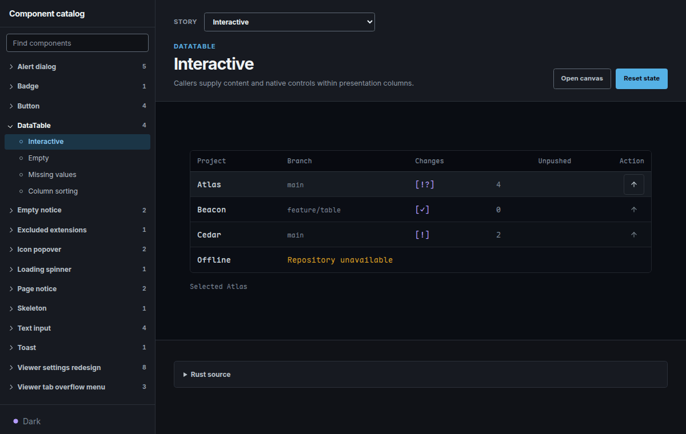

# dx-story

Dioxus component stories for Rust. Add a render function for each state you want to see, then
browse and interact with them in a browser catalog. Stories can use hooks and context.

The `dx-story` library provides the registry and catalog. The optional `dx-story-cli` sets up a
catalog in an existing Cargo package and runs it with Dioxus. This project requires Rust 1.98 or
newer and Dioxus 0.7.10 or newer within the 0.7 series.

## Preview



## Getting started

From a Cargo workspace containing your components:

```sh
cargo install dx-story-cli --locked
dx-story init --package my-ui --dry-run
dx-story init --package my-ui
dx-story doctor
```

`doctor` tells you which Dioxus CLI version and WebAssembly target to install if either is missing.
Once those checks pass, run `dx-story serve --open`. Use `dx-story build --release` to make a
catalog for static hosting.

`init` creates a starter story in `dev/stories.rs`. A story set groups the states of one component:

```rust
use dioxus::prelude::*;
use dx_story::{stories, story};

#[story]
fn interactive() -> Element {
    let mut count = use_signal(|| 0_u32);
    rsx! { button { onclick: move |_| count += 1, "Clicked {count} times" } }
}

#[stories(id = "counter", name = "Counter")]
const COUNTER: () = &[interactive];
```

Add more story modules to the Rust module tree so the compiler includes them. Use `init --embedded`
when stories need crate-private components. The CLI is optional: you can add the library directly,
enable its `catalog` feature, and render `dx_story::catalog::Catalog` in your own root to provide
application context and styles.

## References

- [CLI setup and configuration](https://crates.io/crates/dx-story-cli)
- [Library API](https://docs.rs/dx-story)
